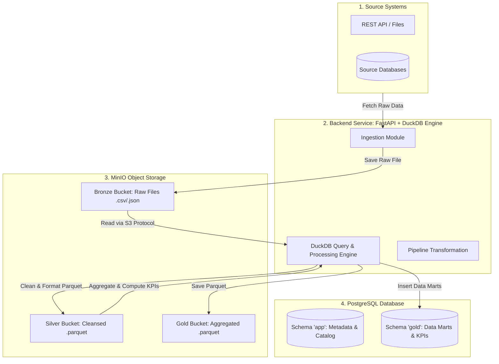

# 🏗️ Kiến Trúc Xử Lý & Lưu Trữ Dữ Liệu (Data Lake & Processing Engine)

Tài liệu này mô tả chi tiết kiến trúc phân bổ dữ liệu 3 tầng (**Bronze - Silver - Gold**), vị trí xử lý dữ liệu và luồng vận hành của engine **DuckDB + FastAPI Backend** trong hệ thống **UniDataLake AI**.

---

## 📋 Mục lục

1. [Phân Bổ Dữ Liệu 3 Tầng: MinIO vs PostgreSQL](#1-phân-bổ-dữ-liệu-3-tầng-minio-vs-postgresql)
2. [Vị Trí & Công Cụ Xử Lý Dữ Liệu (Where & How Data is Processed)](#2-vị-trí--công-cụ-xử-lý-dữ-liệu-where--how-data-is-processed)
3. [Luồng Xử Lý Dữ Liệu Chi Tiết (Data Processing Flow)](#3-luồng-xử-lý-dữ-liệu-chi-tiết-data-processing-flow)
4. [Sơ Đồ Luồng Dữ Liệu Kiến Trúc (Architecture Diagram)](#4-sơ-đồ-luồng-dữ-liệu-kiến-trúc-architecture-diagram)

---

## 1. Phân Bổ Dữ Liệu 3 Tầng: MinIO vs PostgreSQL

Dự án áp dụng mô hình **Medallion Architecture (Bronze - Silver - Gold)** được phân bổ giữa Object Storage (MinIO) và Relational Database (PostgreSQL):

| Tầng (Layer) | Vai trò trong MinIO (Object Storage) | Vai trò trong PostgreSQL (Relational DB) |
| :--- | :--- | :--- |
| 🥉 **Bronze Layer** *(Raw Data)* | **Nơi lưu trữ chính**: Chứa toàn bộ các file thô nguyên bản (`.csv`, `.json`, `.xlsx`) vừa thu thập từ các hệ thống nguồn. Đã bật **Versioning** để lưu lịch sử vết dữ liệu. | Không lưu file thô. Chỉ lưu các thông tin **Metadata** danh mục nguồn (bảng `dataset`, `data_source` trong schema `app`). |
| 🥈 **Silver Layer** *(Cleansed & Standardized)* | **Nơi lưu trữ chính**: Chứa dữ liệu đã được làm sạch, lọc bỏ bản ghi rác, chuẩn hóa kiểu dữ liệu và lưu dưới dạng file **Parquet** tối ưu cho truy vấn. | Lưu thông tin Data Catalog (`catalog_table`, `catalog_column`), Data Quality rules và Data Lineage. |
| 🥇 **Gold Layer** *(Curated Analytics & Data Marts)* | Lưu trữ các file Parquet tổng hợp dung lượng lớn cho phân tích chuyên sâu. | **Nơi lưu trữ chính (Schema `gold`)**: Chứa các Bảng/Views tổng hợp tinh lọc (KPIs, Data Marts) phục vụ trực tiếp cho **Text-to-SQL AI**, Dashboard và Role đọc `unilake_reader`. |

---

## 2. Vị Trí & Công Cụ Xử Lý Dữ Liệu (Where & How Data is Processed)

### ❓ Dữ liệu được xử lý ở đâu?
👉 Dữ liệu được xử lý tại **Backend Service (`unilake-backend`)** thông qua công cụ tính toán **DuckDB Engine** (nhúng trực tiếp bên trong Python).

- **Nơi điều phối & chứa Code (Orchestration)**:
  - Thư mục `backend/app/modules/ingestion/`: Quản lý kết nối nguồn và thu thập dữ liệu về Bronze.
  - Thư mục `backend/app/modules/pipeline/`: Quản lý các bước biến đổi dữ liệu (Transformation Steps) từ Bronze sang Silver/Gold.
- **Engine tính toán thực sự (Processing Engine)**:
  - **DuckDB**: Đóng vai trò là In-Memory / File Analytical Engine. DuckDB kết nối trực tiếp với MinIO S3 qua chuẩn giao thức S3 Protocol, thực thi các câu lệnh SQL biến đổi với tốc độ cao mà không làm quá tải RAM hệ thống.

---

## 3. Luồng Xử Lý Dữ Liệu Chi Tiết (Data Processing Flow)

1. **Bước 1: Ingestion (Nguồn -> MinIO Bronze)**
   - Backend đọc dữ liệu từ các hệ thống nguồn (API/RDBMS/Excel) và đẩy nguyên văn file thô vào MinIO Bucket `bronze`.

2. **Bước 2: Transformation & Cleaning (MinIO Bronze -> MinIO Silver)**
   - DuckDB Engine nhúng trong Backend nạp file từ MinIO Bucket `bronze`.
   - Thực thi làm sạch: xử lý `NULL`, chuẩn hóa tên cột, chuyển kiểu dữ liệu.
   - DuckDB xuất kết quả ra file chuẩn định dạng **Parquet** và lưu vào MinIO Bucket `silver`.

3. **Bước 3: Aggregation & Serving (MinIO Silver -> Gold Layer)**
   - DuckDB tổng hợp dữ liệu từ Silver thành các chỉ số KPI, Data Mart.
   - Kết quả vừa được lưu thành Parquet ở MinIO Bucket `gold`, vừa được nạp vào các Bảng / Views thuộc **PostgreSQL Schema `gold`** phục vụ cho AI Text-to-SQL và Dashboard.

---

## 4. Sơ Đồ Luồng Dữ Liệu Kiến Trúc (Architecture Diagram)

