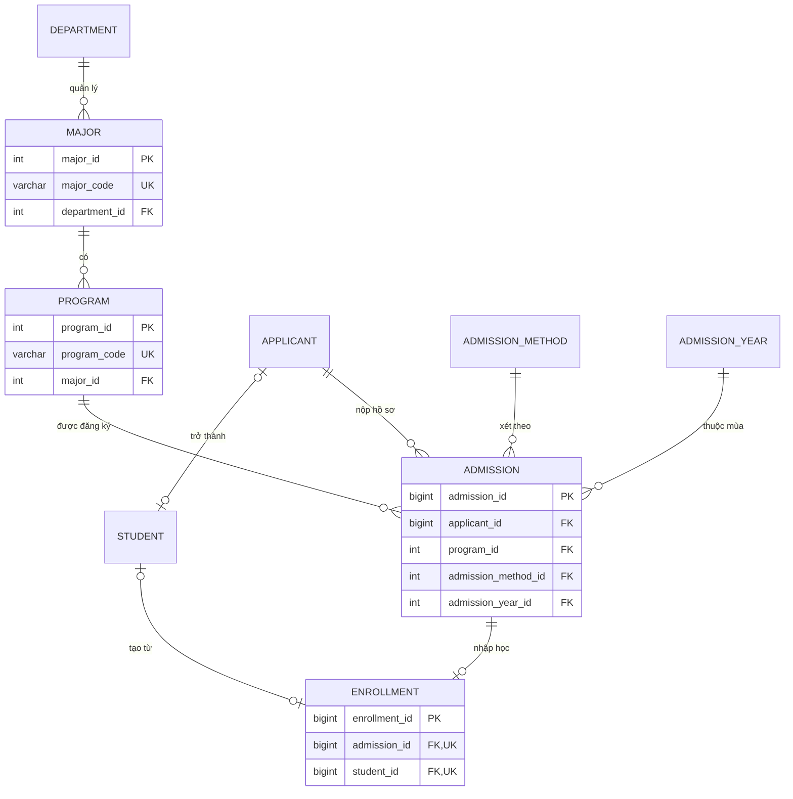

# Admissions Dataset Schema V1

| Mục | Giá trị |
|---|---|
| Domain | Admissions (Tuyển sinh) |
| Phiên bản | 1.1.0 |
| Nguồn chuẩn | [unilake-db.dbml](unilake-db.dbml): thiết kế DB nguồn của team (dbdiagram.io) |
| Phạm vi | Theo proposal: Applicant, Admission, Program, Major, Admission Method, Enrollment, Admission Year |
| Dùng cho | Data Ingestion (W3), lớp Bronze → Silver → Gold, NLQ |

Các file đi kèm:

| File | Vai trò |
|---|---|
| [unilake-db.dbml](unilake-db.dbml) | DB nguồn toàn hệ thống. Schema Admissions bám đúng tên bảng, tên cột, kiểu, PK, FK ở đây |
| [admissions_v1.schema.json](admissions_v1.schema.json) | Schema máy đọc: kiểu, null, unique, enum, pattern, FK, luật DQ. Ingestion dùng để validate |
| [admissions_v1.sql](admissions_v1.sql) | DDL PostgreSQL cho 7 bảng Admissions, thêm CHECK từ note trong DBML |
| `data/samples/admissions/*.csv` | Dữ liệu mẫu 7 bảng Admissions |
| `data/samples/hr/department.csv` | Đơn vị tổ chức mà `major` tham chiếu, thuộc [HR Dataset V1](hr-dataset-v1.md) |
| `data/samples/training/student.csv` | Sinh viên tạo từ enrollment `Enrolled`; bảng thuộc [Academic Dataset V1](academic-dataset-v1.md) |
| [data/synthetic/generate_admissions.py](../../data/synthetic/generate_admissions.py) | Sinh lại toàn bộ dữ liệu mẫu (seed cố định) |
| [backend/tests/test_dataset_schemas.py](../../backend/tests/test_dataset_schemas.py) | Kiểm tra chung cho mọi dataset: JSON khớp DBML (tên, kiểu, null), CSV khớp JSON, PK/unique, FK, DDL |
| [backend/tests/test_admissions_dataset.py](../../backend/tests/test_admissions_dataset.py) | Kiểm tra luật nghiệp vụ ADM-DQ-04..12 |

Khi DBML đổi, sửa JSON, SQL, script sinh dữ liệu và tài liệu này trong cùng một PR. Test `test_schema_matches_source_dbml` sẽ báo lỗi khi JSON lệch DBML.

## 1. Quy ước

Theo quy ước đang dùng trong DBML:

| Đối tượng | Quy ước | Ví dụ |
|---|---|---|
| Bảng, cột | `snake_case`, số ít, tiếng Anh | `admission_method`, `application_date` |
| PK | `<bảng>_id`, tự tăng (`int` cho bảng danh mục, `bigint` cho bảng giao dịch) | `admission_id bigint` |
| FK | Trùng tên PK được tham chiếu | `admission.program_id` |
| Mã nghiệp vụ | `<bảng>_code`, `unique` | `program_code` |
| Giá trị trạng thái | Tiếng Anh, viết hoa chữ đầu | `Accepted`, `Enrolled` |
| Ngày | `date`, `YYYY-MM-DD` | `2025-07-20` |
| File mẫu | `<bảng>.csv`, UTF-8, dấu `,`, có header đúng thứ tự cột DBML, ô trống = `NULL` | `admission.csv` |
| Cột audit (Silver/Gold) | tiền tố `_` | `_source_system`, `_batch_id`, `_ingested_at` |

Mỗi file CSV là bản dump của một bảng nguồn, giữ nguyên ID của nguồn.

## 2. Sơ đồ quan hệ



| Quan hệ | Bản số | Ghi chú |
|---|---|---|
| department → major | 1 - N | `department_id` được để trống. `department` thuộc HR |
| major → program | 1 - N | Một ngành có chương trình chuẩn, CLC, thạc sĩ... Thí sinh đăng ký theo **chương trình** |
| applicant → admission | 1 - N | Một thí sinh nộp nhiều hồ sơ |
| program / admission_method / admission_year → admission | 1 - N | Duy nhất theo `(applicant_id, program_id, admission_year_id, admission_method_id)` |
| admission → enrollment | 1 - 0..1 | Chỉ hồ sơ `Accepted` |
| student → enrollment | 0..1 - 0..1 | `student_id` chỉ có khi `Enrolled`. `student` thuộc Training |

## 3. Đặc tả bảng

Cột **Null**: `N` = bắt buộc (`not null`), `Y` = được để trống.

### 3.1 `admission_year` – Mùa tuyển sinh

| Cột | Kiểu | Null | Khóa | Ràng buộc / mô tả |
|---|---|---|---|---|
| admission_year_id | int | N | PK | |
| year_label | varchar(9) | N | UK | `YYYY-YYYY`, ví dụ `2025-2026` |
| start_date | date | N | | Mở mùa tuyển sinh |
| end_date | date | N | | `> start_date`. Bao trọn nhận hồ sơ, xét tuyển, nhập học |

### 3.2 `major` – Ngành

| Cột | Kiểu | Null | Khóa | Ràng buộc / mô tả |
|---|---|---|---|---|
| major_id | int | N | PK | |
| major_code | varchar(20) | N | UK | Mã ngành Bộ GD&ĐT, 7 chữ số, ví dụ `7480201` |
| major_name | varchar(150) | N | | |
| department_id | int | Y | FK → department | |

### 3.3 `program` – Chương trình đào tạo

| Cột | Kiểu | Null | Khóa | Ràng buộc / mô tả |
|---|---|---|---|---|
| program_id | int | N | PK | |
| program_code | varchar(20) | N | UK | `<NGÀNH>-<HỆ>`, ví dụ `CNTT-CQ`, `CNTT-CLC`, `KTXD-KS` |
| program_name | varchar(200) | N | | |
| major_id | int | N | FK → major | |
| degree_level | varchar(30) | N | | `Bachelor`, `Engineer`, `Master` |
| duration_years | decimal(3,1) | N | | 1 - 6 |
| tuition_fee_per_credit | decimal(12,2) | Y | | VND/tín chỉ, `>= 0` |

### 3.4 `admission_method` – Phương thức xét tuyển

| Cột | Kiểu | Null | Khóa | Ràng buộc / mô tả |
|---|---|---|---|---|
| admission_method_id | int | N | PK | |
| method_code | varchar(20) | N | UK | `THPT`, `HOCBA`, `XTT` (đúng 3 phương thức trong note DBML) |
| method_name | varchar(150) | N | | |
| description | text | Y | | |

### 3.5 `applicant` – Thí sinh

| Cột | Kiểu | Null | Khóa | Ràng buộc / mô tả |
|---|---|---|---|---|
| applicant_id | bigint | N | PK | |
| national_id | varchar(20) | N | UK | CCCD 12 chữ số. **PII** |
| full_name | varchar(150) | N | | **PII** |
| date_of_birth | date | N | | **PII**. Tuổi tại mùa tuyển sinh 16 - 30 |
| gender | varchar(10) | N | | `Male`, `Female` |
| phone | varchar(20) | Y | | `0` + 9 chữ số. **PII** |
| email | varchar(150) | Y | | **PII** |
| high_school_name | varchar(200) | Y | | |
| province | varchar(100) | Y | | Tên tỉnh/thành theo danh mục sau sáp nhập 2025 |

### 3.6 `admission` – Hồ sơ xét tuyển

| Cột | Kiểu | Null | Khóa | Ràng buộc / mô tả |
|---|---|---|---|---|
| admission_id | bigint | N | PK | |
| applicant_id | bigint | N | FK → applicant | |
| program_id | int | N | FK → program | |
| admission_method_id | int | N | FK → admission_method | |
| admission_year_id | int | N | FK → admission_year | |
| application_date | date | N | | Trong `[start_date, end_date]` của mùa |
| admission_score | decimal(5,2) | Y | | Thang 30, đã cộng ưu tiên. `NULL` khi `XTT` |
| admission_status | varchar(20) | N | | `Applied`, `Accepted`, `Rejected`, `Waitlisted` |

### 3.7 `enrollment` – Nhập học

| Cột | Kiểu | Null | Khóa | Ràng buộc / mô tả |
|---|---|---|---|---|
| enrollment_id | bigint | N | PK | |
| admission_id | bigint | N | FK → admission, UK | Hồ sơ phải `Accepted` |
| student_id | bigint | Y | FK → student, UK | Có khi và chỉ khi `Enrolled` |
| enrollment_date | date | N | | Sau ngày nộp hồ sơ, trước `end_date` của mùa |
| enrollment_status | varchar(20) | N | | `Enrolled`, `Deferred`, `Cancelled` |

## 4. Luật chất lượng dữ liệu (DQ)

Chạy ở bước Bronze → Silver. Dòng vi phạm `error` bị cách ly (quarantine), `warning` vẫn nạp và ghi vào Quality Report. Test tự động đã kiểm cả 12 luật trên dữ liệu mẫu.

| ID | Bảng | Luật | Mức |
|---|---|---|---|
| ADM-DQ-01 | tất cả | PK và cột unique không null, không trùng | error |
| ADM-DQ-02 | tất cả | FK trỏ tới bản ghi có thật | error |
| ADM-DQ-03 | tất cả | Đúng kiểu, độ dài, enum, pattern, min/max | error |
| ADM-DQ-04 | admission_year | `end_date > start_date` | error |
| ADM-DQ-05 | admission | `application_date` nằm trong mùa tuyển sinh | error |
| ADM-DQ-06 | admission | `XTT` không có điểm; `THPT`/`HOCBA` có điểm khi đã có kết quả | error |
| ADM-DQ-07 | admission | Mỗi thí sinh tối đa một hồ sơ `Accepted` mỗi mùa | error |
| ADM-DQ-08 | applicant | Tuổi tại mùa tuyển sinh 16 - 30 | warning |
| ADM-DQ-09 | enrollment | Hồ sơ `Accepted`; `enrollment_date` hợp lệ theo mùa | error |
| ADM-DQ-10 | enrollment | `Enrolled` ⇔ có `student_id` | error |
| ADM-DQ-11 | enrollment | `student` khớp `applicant_id`, `program_id`, `admission_year_id` của hồ sơ | error |
| ADM-DQ-12 | student | Họ tên, ngày sinh, giới tính khớp `applicant` | warning |

## 5. Dữ liệu cá nhân (PII)

`applicant` có `national_id`, `full_name`, `date_of_birth`, `phone`, `email` (khai báo ở `pii_columns` trong schema JSON).

- **Bronze:** giữ nguyên, chỉ Data Administrator đọc được.
- **Silver:** `national_id`, `phone`, `email` băm (SHA-256 có salt) hoặc bỏ; `full_name` bỏ; `date_of_birth` rút còn `birth_year`.
- **Gold và NLQ:** không có cột PII. Catalog không publish cột PII, nên LLM không nhìn thấy.

Dữ liệu mẫu là giả lập: tên ghép ngẫu nhiên, số CCCD đúng định dạng (mã tỉnh, thế kỷ + giới tính, năm sinh) nhưng 6 số cuối ngẫu nhiên, email dùng tên miền dự phòng `example.com`.

## 6. Hướng dẫn ingestion (W3)

**Thứ tự nạp** (theo FK): `department` → `major` → `program` → `admission_method` → `admission_year` → `applicant` → `admission` → `student` → `enrollment`.

**Bronze:** `bronze/admissions/<table>/ingest_date=YYYY-MM-DD/<batch_id>.csv`, giữ nguyên file.

**Bronze → Silver:**

1. Kiểm tra header theo `admissions_v1.schema.json`.
2. Ép kiểu, kiểm tra null/enum/pattern/range (DQ-01..03).
3. Kiểm tra FK theo thứ tự nạp (DQ-02) và luật nghiệp vụ (DQ-04..12).
4. Xử lý PII theo mục 5, thêm cột audit.
5. Upsert theo PK nguồn; gửi kết quả DQ và lineage cho `governance`.

**Gold (gợi ý):** số hồ sơ, tỷ lệ trúng tuyển, tỷ lệ nhập học theo chương trình, ngành, khoa, phương thức, mùa, tỉnh. Điểm chuẩn thực tế = `MIN(admission_score)` của hồ sơ `Accepted` theo chương trình, phương thức, mùa.

## 7. Dữ liệu mẫu

Giả lập 3 mùa 2024-2025, 2025-2026, 2026-2027, mỗi mùa 40 thí sinh. Sinh lại bằng `python data/synthetic/generate_admissions.py`, chạy sau `generate_hr.py` (cùng seed thì ra đúng cùng dữ liệu). Ngành trỏ tới 4 khoa: CNTT, Kinh tế, Ngoại ngữ, Xây dựng.

| File | Dòng | Nội dung |
|---|---|---|
| admissions/major.csv | 8 | 7 ngành đại học + 1 ngành thạc sĩ, mã Bộ GD&ĐT |
| admissions/program.csv | 10 | Chương trình chuẩn, CLC, kỹ sư, thạc sĩ (thạc sĩ không có hồ sơ vì không xét THPT/học bạ) |
| admissions/admission_method.csv | 3 | THPT, Học bạ, Xét tuyển thẳng |
| admissions/admission_year.csv | 3 | Mùa từ 01/03 đến 30/09 |
| admissions/applicant.csv | 120 | Phần lớn ở Đà Nẵng và miền Trung; một số ô tùy chọn để trống |
| admissions/admission.csv | 246 | 74 Accepted, 157 Rejected, 9 Waitlisted, 6 Applied (xét bổ sung tháng 9/2026) |
| training/student.csv | 63 | Sinh viên tạo từ enrollment `Enrolled` |
| admissions/enrollment.csv | 74 | 63 Enrolled, 4 Deferred, 7 Cancelled |

Logic sinh dữ liệu:

- Học bạ nộp 15/03 - 15/06, tuyển thẳng 01/04 - 20/06, THPT 16/07 - 28/07, xét bổ sung 05/09 - 20/09. Kết quả công bố 20/08, nhập học 22/08 - 12/09.
- Mỗi thí sinh 1 - 3 hồ sơ. Điểm THPT và học bạ tương quan theo cùng "năng lực" của thí sinh; điểm chuẩn riêng theo chương trình, tăng nhẹ theo năm, học bạ cao hơn THPT khoảng 2 điểm.
- Đủ điểm ở nhiều hồ sơ thì chỉ hồ sơ đầu tiên `Accepted`, các hồ sơ còn lại `Rejected`. Thiếu dưới 0,5 điểm thì có thể `Waitlisted`.
- Sinh viên khóa 2024, 2025 có một ít `Suspended`/`Dropped`; khóa 2026 đều `Active`.

Chạy kiểm tra:

```bash
cd backend && pytest tests/test_dataset_schemas.py tests/test_admissions_dataset.py -o addopts=""
```

## 8. Các điểm trong DBML cần team xem

1. **Thang điểm.** `admission_score decimal(5,2)` không kèm thang điểm. Ổn khi chỉ có THPT và học bạ (thang 30). Nếu thêm ĐGNL (thang 1200) thì cột bị tràn và không so sánh được điểm; khi đó cần thêm `admission_method.max_score` và đổi kiểu điểm.
2. **Không có thứ tự nguyện vọng, ngày có kết quả.** Không phân tích được "trúng nguyện vọng mấy" hay thời gian xử lý hồ sơ. Luật DQ-07 thay thế một phần.
3. **Dữ liệu trùng giữa `student` và `applicant`** (họ tên, ngày sinh, giới tính) và hai đường nối (`student.applicant_id` và `enrollment.student_id`) dễ lệch nhau. DQ-11, DQ-12 kiểm tra việc này.
4. **PII** có ở `applicant`, `student`, `employee`: cần thống nhất cách xử lý ở mục 5 cho cả ba domain.
5. **Ngoài Admissions:** `kpi_value.kpi_id` là `bigint` trong khi `kpi.kpi_id` là `int`, nên đổi cho cùng kiểu.
6. **ERD cũ** [unilake-erd.mmd](unilake-erd.mmd) / `.html` được vẽ trước khi có DBML và lệch ở cả ba domain (ví dụ ở đó `program` chứa `major`, còn DBML là `major` có nhiều `program`). Nên vẽ lại từ DBML hoặc bỏ.
