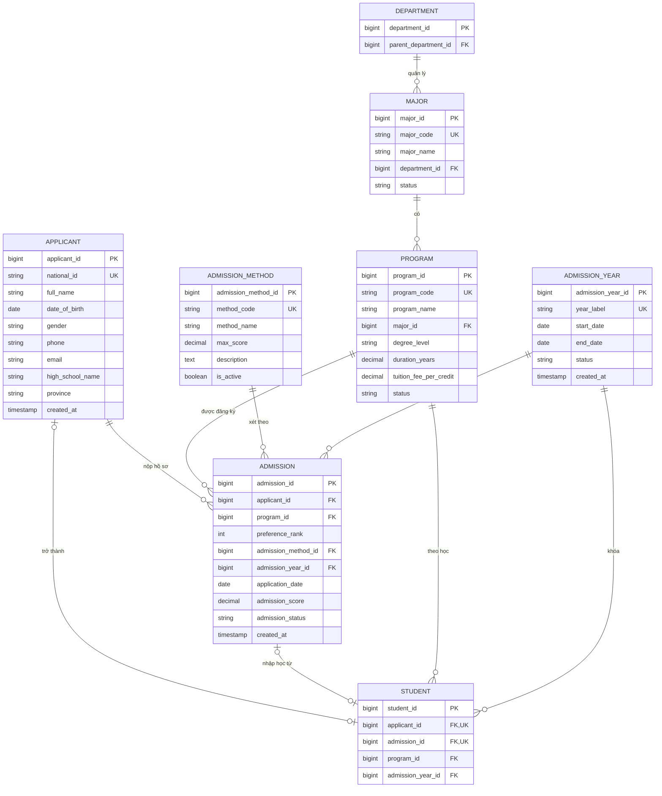

# Admissions Dataset Schema V1

| Mục | Giá trị |
|---|---|
| Domain | Admissions (Tuyển sinh) |
| Phiên bản tài liệu | 1.3.0 (cập nhật theo DB ngày 01/10/2026) |
| Nguồn chuẩn | [unilake-db-architecture.txt](unilake-db-architecture.txt): UniLake AI Database Architecture |
| Phạm vi | Theo proposal: Applicant, Admission, Program, Major, Admission Method, Admission Year; "Enrollment" (nhập học) thể hiện qua `student.admission_id` |
| Dùng cho | Data Ingestion (W3), lớp Bronze → Silver → Gold, NLQ |
| Liên quan | [Academic Dataset V1](academic-dataset-v1.md) (`student`, `curriculum`); [HR Dataset V1](hr-dataset-v1.md) (`department`) |

Các file đi kèm:

| File | Vai trò | Trạng thái |
|---|---|---|
| [unilake-db-architecture.txt](unilake-db-architecture.txt) | DB nguồn toàn hệ thống. Tên bảng, tên cột, thứ tự, kiểu, null, PK, UNIQUE, FK trong tài liệu này lấy từ file này | Nguồn chuẩn |
| [admissions_v1.schema.json](admissions_v1.schema.json) | Schema máy đọc: kiểu DB và kiểu SQL, null, unique, giá trị hợp lệ, FK, luật DQ. Ingestion dùng để validate | Khớp DB (có test) |
| [admissions_v1.sql](admissions_v1.sql) | DDL PostgreSQL cho 6 bảng Admissions; chạy sau `hr_v1.sql` | Khớp DB (có test) |
| [backend/tests/test_dataset_schemas.py](../../backend/tests/test_dataset_schemas.py) | Đối chiếu JSON với DB, DDL với JSON, và kiểm tra CSV mẫu theo JSON | Đã cập nhật |
| `data/samples/admissions/*.csv` | Dữ liệu mẫu | Sinh theo DB cũ, cần sinh lại (mục 7) |
| [data/synthetic/generate_admissions.py](../../data/synthetic/generate_admissions.py) | Sinh dữ liệu mẫu (seed cố định) | Cần cập nhật theo DB mới |
| [backend/tests/test_admissions_dataset.py](../../backend/tests/test_admissions_dataset.py) | Kiểm tra luật nghiệp vụ trên dữ liệu mẫu | Cần cập nhật theo DB mới |

Khi DB đổi, sửa tài liệu, JSON, SQL, script sinh dữ liệu và test trong cùng một PR.

## 1. Quy ước

| Đối tượng | Quy ước | Ví dụ |
|---|---|---|
| Bảng, cột | `snake_case`, số ít, tiếng Anh | `admission_method`, `application_date` |
| PK | `<bảng>_id`, `bigint`, tự tăng; áp dụng cho mọi bảng, kể cả bảng danh mục | `admission_year_id bigint` |
| FK | Trùng tên và trùng kiểu `bigint` với PK được tham chiếu | `admission.program_id bigint` |
| Mã nghiệp vụ | `<bảng>_code`, `unique` | `program_code`, `method_code` |
| Giá trị trạng thái | Tiếng Anh, viết hoa chữ đầu | `Accepted`, `Active` |
| Cờ bật/tắt | `is_<tính từ>`, `boolean` | `is_active` |
| Ngày, thời điểm | `date` dạng `YYYY-MM-DD`; `timestamp` dạng `YYYY-MM-DD HH:MM:SS` | `application_date`, `created_at` |
| Cột audit nguồn | `created_at timestamp`, mặc định `now()` | có ở `admission_year`, `applicant`, `admission` |
| Cột audit Silver/Gold | tiền tố `_` | `_source_system`, `_batch_id`, `_ingested_at` |
| File mẫu | `<bảng>.csv`, UTF-8, dấu `,`, có header đúng thứ tự cột DB, ô trống = `NULL` | `admission.csv` |

Cách đọc bảng đặc tả ở mục 3:

- **Kiểu DB**: kiểu khai báo trong file DB (`bigint`, `int`, `string`, `decimal`, `text`, `date`, `timestamp`, `boolean`).
- **Kiểu SQL**: kiểu PostgreSQL đề xuất cho DDL. DB chỉ ghi `string`/`decimal` nên độ dài `varchar` và độ chính xác `decimal` là đề xuất của dataset (lấy theo bản DB ngày 27/09).
- **Null**: lấy từ DB. Cột có cờ `nullable` là `Y`, còn lại là `N` (NOT NULL).
- **Khóa**: PK, FK, UK (UNIQUE) lấy từ DB.
- **Ràng buộc / mô tả**: giá trị hợp lệ, pattern, khoảng giá trị là đề xuất của dataset, được đưa vào CHECK trong DDL.

Mỗi file CSV là bản dump của một bảng nguồn, giữ nguyên ID của nguồn.

## 2. Sơ đồ quan hệ

```mermaid
erDiagram
    DEPARTMENT ||--o{ MAJOR : "quản lý"
    MAJOR ||--o{ PROGRAM : "có"
    APPLICANT ||--o{ ADMISSION : "nộp hồ sơ"
    PROGRAM ||--o{ ADMISSION : "được đăng ký"
    ADMISSION_METHOD ||--o{ ADMISSION : "xét theo"
    ADMISSION_YEAR ||--o{ ADMISSION : "thuộc mùa"
    APPLICANT |o--o| STUDENT : "trở thành"
    ADMISSION |o--o| STUDENT : "nhập học từ"
    PROGRAM ||--o{ STUDENT : "theo học"
    ADMISSION_YEAR ||--o{ STUDENT : "khóa"

    DEPARTMENT {
        bigint department_id PK
        bigint parent_department_id FK
    }
    MAJOR {
        bigint major_id PK
        string major_code UK
        string major_name
        bigint department_id FK
        string status
    }
    PROGRAM {
        bigint program_id PK
        string program_code UK
        string program_name
        bigint major_id FK
        string degree_level
        decimal duration_years
        decimal tuition_fee_per_credit
        string status
    }
    ADMISSION_METHOD {
        bigint admission_method_id PK
        string method_code UK
        string method_name
        decimal max_score
        text description
        boolean is_active
    }
    ADMISSION_YEAR {
        bigint admission_year_id PK
        string year_label UK
        date start_date
        date end_date
        string status
        timestamp created_at
    }
    APPLICANT {
        bigint applicant_id PK
        string national_id UK
        string full_name
        date date_of_birth
        string gender
        string phone
        string email
        string high_school_name
        string province
        timestamp created_at
    }
    ADMISSION {
        bigint admission_id PK
        bigint applicant_id FK
        bigint program_id FK
        int preference_rank
        bigint admission_method_id FK
        bigint admission_year_id FK
        date application_date
        decimal admission_score
        string admission_status
        timestamp created_at
    }
    STUDENT {
        bigint student_id PK
        bigint applicant_id FK, UK
        bigint admission_id FK, UK
        bigint program_id FK
        bigint admission_year_id FK
    }
```

| Quan hệ | Bản số | Ghi chú |
|---|---|---|
| department → major | 1 - N | `major.department_id` bắt buộc; `department` thuộc HR |
| major → program | 1 - N | Một ngành có chương trình chuẩn, CLC, kỹ sư, thạc sĩ. Thí sinh đăng ký theo **chương trình** |
| applicant → admission | 1 - N | Một thí sinh nộp nhiều nguyện vọng, xếp theo `preference_rank` |
| program / admission_method / admission_year → admission | 1 - N | |
| admission → student | 1 - 0..1 | `student.admission_id` (UNIQUE, được để trống): hồ sơ trúng tuyển dẫn tới nhập học. `student` thuộc Academic |
| applicant → student | 1 - 0..1 | `student.applicant_id` (UNIQUE, được để trống) |

**Về "Enrollment" trong proposal.** Theo DB, `enrollment` là **đăng ký lớp học phần** (sinh viên × lớp) và thuộc nhóm Academic, nên được đặc tả ở [Academic Dataset V1](academic-dataset-v1.md). Việc thí sinh nhập học được ghi nhận bằng dòng `student` có `admission_id` trỏ tới hồ sơ `Accepted` (ADM-DQ-11).

## 3. Đặc tả bảng

### 3.1 `admission_year` – Mùa tuyển sinh

| Cột | Kiểu DB | Kiểu SQL | Null | Khóa | Ràng buộc / mô tả |
|---|---|---|---|---|---|
| admission_year_id | bigint | bigint | N | PK |  |
| year_label | string | varchar(20) | N | UK | `^[0-9]{4}-[0-9]{4}$` |
| start_date | date | date | N |  |  |
| end_date | date | date | N |  |  |
| status | string | varchar(20) | N |  | `Upcoming`, `Open`, `Closed` |
| created_at | timestamp | timestamp | N |  |  |

`start_date`..`end_date` bao trọn nhận hồ sơ, xét tuyển và nhập học.

### 3.2 `major` – Ngành

| Cột | Kiểu DB | Kiểu SQL | Null | Khóa | Ràng buộc / mô tả |
|---|---|---|---|---|---|
| major_id | bigint | bigint | N | PK |  |
| major_code | string | varchar(30) | N | UK | Mã ngành Bộ GD&ĐT (7 chữ số); `^[0-9]{7}$` |
| major_name | string | varchar(200) | N |  |  |
| department_id | bigint | bigint | N | FK → department | Khoa quản lý ngành (department_type = Faculty) |
| status | string | varchar(20) | N |  | `Active`, `Inactive` |

`major` và `program` dùng chung với Academic (`student`, `curriculum`).

### 3.3 `program` – Chương trình đào tạo

| Cột | Kiểu DB | Kiểu SQL | Null | Khóa | Ràng buộc / mô tả |
|---|---|---|---|---|---|
| program_id | bigint | bigint | N | PK |  |
| program_code | string | varchar(30) | N | UK | `^[A-Z]+-[A-Z]+$` |
| program_name | string | varchar(200) | N |  |  |
| major_id | bigint | bigint | N | FK → major |  |
| degree_level | string | varchar(50) | N |  | `Bachelor`, `Engineer`, `Master` |
| duration_years | decimal | decimal(4,1) | Y |  | 1 - 6 |
| tuition_fee_per_credit | decimal | decimal(15,2) | Y |  | VND/tín chỉ; `>= 0` |
| status | string | varchar(20) | N |  | `Active`, `Inactive`, `Deprecated` |

### 3.4 `admission_method` – Phương thức xét tuyển

| Cột | Kiểu DB | Kiểu SQL | Null | Khóa | Ràng buộc / mô tả |
|---|---|---|---|---|---|
| admission_method_id | bigint | bigint | N | PK |  |
| method_code | string | varchar(30) | N | UK | Hiện dùng THPT, HOCBA, XTT; `^[A-Z0-9_]{2,30}$` |
| method_name | string | varchar(150) | N |  |  |
| max_score | decimal | decimal(6,2) | N |  | Thang điểm tối đa: 30 (THPT, HOCBA), 1200 (ĐGNL), 0 = không xét điểm (XTT); `>= 0` |
| description | text | text | Y |  |  |
| is_active | boolean | boolean | N |  |  |

`max_score` cho biết thang điểm của phương thức, để so sánh điểm giữa các phương thức (`admission_score / max_score`). DB khai báo `max_score` NOT NULL nên phương thức không xét điểm (`XTT`) dùng quy ước `max_score = 0`. `is_active = false` thì phương thức không nhận hồ sơ mới.

### 3.5 `applicant` – Thí sinh

| Cột | Kiểu DB | Kiểu SQL | Null | Khóa | Ràng buộc / mô tả |
|---|---|---|---|---|---|
| applicant_id | bigint | bigint | N | PK |  |
| national_id | string | varchar(30) | Y | UK | Số CCCD 12 chữ số; null với thí sinh chưa có CCCD (ví dụ người nước ngoài); `^[0-9]{12}$`; **PII** |
| full_name | string | varchar(200) | N |  | **PII** |
| date_of_birth | date | date | Y |  | **PII** |
| gender | string | varchar(20) | Y |  | `Male`, `Female` |
| phone | string | varchar(30) | Y |  | `^0[0-9]{9}$`; **PII** |
| email | string | varchar(150) | Y |  | `^[a-z0-9._]+@[a-z0-9.-]+\.[a-z]{2,}$`; **PII** |
| high_school_name | string | varchar(250) | Y |  |  |
| province | string | varchar(100) | Y |  |  |
| created_at | timestamp | timestamp | N |  |  |

Chỉ `full_name` là bắt buộc trong các cột thông tin cá nhân. `national_id` là UNIQUE nhưng được để trống, ví dụ thí sinh chưa có CCCD.

### 3.6 `admission` – Hồ sơ xét tuyển

| Cột | Kiểu DB | Kiểu SQL | Null | Khóa | Ràng buộc / mô tả |
|---|---|---|---|---|---|
| admission_id | bigint | bigint | N | PK |  |
| applicant_id | bigint | bigint | N | FK → applicant |  |
| program_id | bigint | bigint | N | FK → program |  |
| preference_rank | int | int | N |  | Thứ tự nguyện vọng, 1 = cao nhất; 1 - 99 |
| admission_method_id | bigint | bigint | N | FK → admission_method |  |
| admission_year_id | bigint | bigint | N | FK → admission_year |  |
| application_date | date | date | Y |  |  |
| admission_score | decimal | decimal(6,2) | Y |  | Theo thang max_score của phương thức, đã cộng ưu tiên; null khi XTT hoặc chưa có điểm; `>= 0` |
| admission_status | string | varchar(30) | N |  | `Applied`, `Accepted`, `Rejected`, `Waitlisted` |
| created_at | timestamp | timestamp | N |  |  |

UNIQUE đề xuất (chưa có trong DB, đã đưa vào DDL): `(applicant_id, admission_year_id, preference_rank)`; `(applicant_id, program_id, admission_year_id, admission_method_id)`. Mỗi thí sinh tối đa một hồ sơ `Accepted` mỗi mùa (unique index một phần trong DDL).

## 4. Luật chất lượng dữ liệu (DQ)

Chạy ở bước Bronze → Silver. Dòng vi phạm `error` bị cách ly (quarantine), `warning` vẫn nạp và ghi vào Quality Report. Luật DQ-01..03 kiểm tra chung theo schema JSON; các luật còn lại là luật nghiệp vụ.

| ID | Bảng | Luật | Mức |
|---|---|---|---|
| ADM-DQ-01 | tất cả | PK và cột unique không null, không trùng | error |
| ADM-DQ-02 | tất cả | FK trỏ tới bản ghi có thật | error |
| ADM-DQ-03 | tất cả | Đúng kiểu, độ dài, null, giá trị trạng thái, pattern, min/max | error |
| ADM-DQ-04 | admission_year | end_date > start_date; tối đa một mùa Open tại một thời điểm | error |
| ADM-DQ-05 | admission | Khi có application_date thì nằm trong mùa tuyển sinh | error |
| ADM-DQ-06 | admission | Phương thức max_score = 0 thì admission_score null; ngược lại admission_score trong [0, max_score] và có điểm khi status khác Applied | error |
| ADM-DQ-07 | admission | Mỗi thí sinh tối đa một hồ sơ Accepted mỗi mùa; nếu trúng thì là nguyện vọng có preference_rank nhỏ nhất đủ điều kiện | error |
| ADM-DQ-08 | admission | Không trùng (applicant_id, admission_year_id, preference_rank) và (applicant_id, program_id, admission_year_id, admission_method_id); preference_rank liên tục từ 1 | error |
| ADM-DQ-09 | applicant | Khi có ngày sinh: tuổi tại mùa tuyển sinh 16 - 30 | warning |
| ADM-DQ-10 | admission | Hồ sơ trỏ tới phương thức is_active = true | warning |
| ADM-DQ-11 | student | Khi có admission_id: hồ sơ Accepted, cùng applicant_id, program_id, admission_year_id với student | error |
| ADM-DQ-12 | student | Khi có applicant_id: họ tên, ngày sinh, giới tính khớp applicant | warning |

## 5. Dữ liệu cá nhân (PII)

`applicant` có `national_id`, `full_name`, `date_of_birth`, `phone`, `email`; `student` (Academic) lặp lại `full_name`, `date_of_birth`, `gender`.

- **Bronze:** giữ nguyên, chỉ Data Administrator đọc được.
- **Silver:** `national_id`, `phone`, `email` băm (SHA-256 có salt) hoặc bỏ; `full_name` bỏ; `date_of_birth` rút còn `birth_year`.
- **Gold và NLQ:** không có cột PII. Catalog không publish cột PII, nên LLM không nhìn thấy.

Dữ liệu mẫu là giả lập: tên ghép ngẫu nhiên, số CCCD đúng định dạng (mã tỉnh, thế kỷ + giới tính, năm sinh) nhưng 6 số cuối ngẫu nhiên, email dùng tên miền dự phòng `example.com`.

## 6. Hướng dẫn ingestion (W3)

**Thứ tự nạp** (theo FK): `department` → `major` → `program` → `admission_method` → `admission_year` → `applicant` → `admission` → `student`. `department` thuộc HR; `student` thuộc Academic và được nạp sau `admission` vì trỏ tới `admission_id`.

**Bronze:** `bronze/admissions/<table>/ingest_date=YYYY-MM-DD/<batch_id>.csv`, giữ nguyên file.

**Bronze → Silver:**

1. Kiểm tra header theo `admissions_v1.schema.json`.
2. Ép kiểu, kiểm tra null, giá trị trạng thái, pattern, range (DQ-01..03).
3. Kiểm tra FK theo thứ tự nạp (DQ-02) và luật nghiệp vụ (DQ-04..12).
4. Xử lý PII theo mục 5, thêm cột audit Silver.
5. Upsert theo PK nguồn; `created_at` giúp nạp tăng dần (chỉ lấy dòng mới). Gửi kết quả DQ và lineage cho `governance`.

**Gold (gợi ý):**

- Số hồ sơ, tỷ lệ trúng tuyển theo chương trình, ngành, khoa, phương thức, mùa, tỉnh.
- Tỷ lệ nhập học = số `student` có `admission_id` / số hồ sơ `Accepted`.
- Điểm chuẩn thực tế = `MIN(admission_score)` của hồ sơ `Accepted` theo chương trình, phương thức, mùa; so sánh giữa phương thức bằng `admission_score / max_score`.
- Tỷ lệ trúng theo thứ tự nguyện vọng (`preference_rank`).

## 7. Dữ liệu mẫu

Dữ liệu mẫu hiện có trong `data/samples/` **được sinh theo DB cũ** (`unilake-db.dbml`, 25/09/2026): 120 thí sinh, 246 hồ sơ, 3 mùa 2024-2025 đến 2026-2027; bảng `admissions/enrollment.csv` cũ mang nghĩa nhập học (74 dòng). Khi sinh lại theo DB mới cần:

| Bảng | Thay đổi |
|---|---|
| `major` | Thêm `status`; `department_id` trỏ tới khoa, không để trống |
| `program` | Thêm `status` |
| `admission_method` | Thêm `max_score` (`THPT`, `HOCBA`: 30; `XTT`: 0), `is_active` |
| `admission_year` | Thêm `status`, `created_at` |
| `applicant` | Thêm `created_at` |
| `admission` | Thêm `preference_rank` theo thứ tự nguyện vọng đã sinh, `created_at`; hồ sơ `Accepted` phải là nguyện vọng đủ điểm có thứ tự nhỏ nhất |
| `student` (Academic) | Thêm `admission_id` trỏ tới hồ sơ `Accepted`, `created_at` |
| `admissions/enrollment.csv` | Bỏ; `enrollment` mới (đăng ký lớp) sinh ở Academic |

Logic sinh dữ liệu giữ nguyên: mỗi thí sinh 1 - 3 nguyện vọng; điểm THPT và học bạ tương quan theo cùng năng lực; điểm chuẩn riêng theo chương trình, tăng nhẹ theo năm. Lịch: học bạ nộp 15/03 - 15/06, tuyển thẳng 01/04 - 20/06, THPT 16/07 - 28/07, xét bổ sung 05/09 - 20/09; kết quả 20/08; nhập học 22/08 - 12/09.

## 8. Các điểm trong DB cần team xem

1. **Kiểu dữ liệu chỉ ở dạng chung.** DB ghi `string`, `decimal` không kèm độ dài; độ dài trong cột "Kiểu SQL" là đề xuất, team cần chốt trước khi tạo bảng thật.
2. **Chưa có CHECK và UNIQUE nhiều cột.** Không trùng thứ tự nguyện vọng `(applicant_id, admission_year_id, preference_rank)`, không trùng `(applicant_id, program_id, admission_year_id, admission_method_id)`, một hồ sơ `Accepted` mỗi mùa: hiện chỉ có trong DDL đề xuất.
3. **`max_score` NOT NULL nhưng `XTT` không xét điểm.** Đang quy ước `max_score = 0`; nên cho `max_score` được để trống để phân biệt "không xét điểm" với "thang 0".
4. **`student` lặp thông tin của hồ sơ.** Đã có `student.admission_id`, nhưng `student` vẫn giữ `applicant_id`, `program_id`, `admission_year_id` riêng nên có thể lệch với hồ sơ; ADM-DQ-11 kiểm tra việc này.
5. **`application_date` được để trống.** Hồ sơ thiếu ngày nộp thì không kiểm được mùa tuyển sinh (ADM-DQ-05) và không tính được thời gian xử lý; chưa có ngày công bố kết quả.
6. **`date_of_birth`, `gender` được để trống.** Luật tuổi (ADM-DQ-09) và thống kê theo giới chỉ áp dụng khi có dữ liệu.
7. **Giá trị trạng thái chưa có danh mục.** Các cột `status` là `string` tự do; giá trị trong tài liệu là đề xuất, cần team chốt.
8. **Tài liệu và mã cũ.** `unilake-db.dbml`, ERD cũ đã bị xóa khỏi thư mục; dữ liệu mẫu, script sinh dữ liệu và test luật nghiệp vụ vẫn theo DB cũ.
