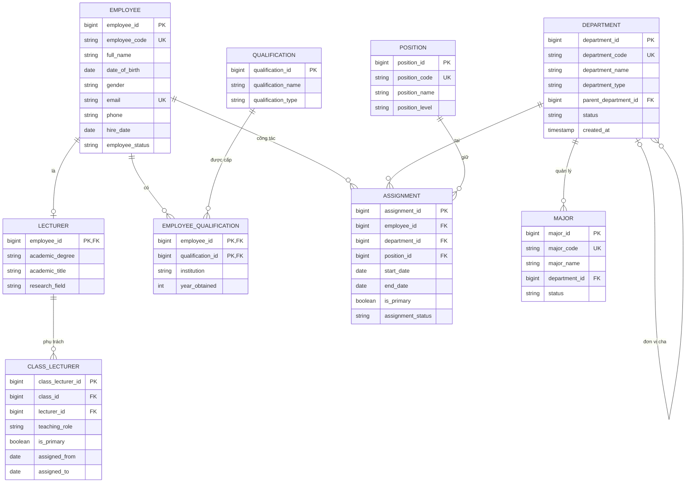

# Human Resources Dataset Schema V1

| Mục | Giá trị |
|---|---|
| Domain | Human Resources (Nhân sự) |
| Phiên bản tài liệu | 1.2.0 (cập nhật theo DB ngày 01/10/2026) |
| Nguồn chuẩn | [unilake-db-architecture.txt](unilake-db-architecture.txt): UniLake AI Database Architecture |
| Phạm vi | Theo proposal: Employee, Lecturer, Department, Position, Qualification, Assignment |
| Dùng cho | Data Ingestion (W3), lớp Bronze → Silver → Gold, NLQ |
| Liên quan | `department` được [Admissions](admissions-dataset-v1.md) (`major`) và governance (`source_system`, `dataset`) tham chiếu; `lecturer` được [Academic](academic-dataset-v1.md) (`class_lecturer`) tham chiếu; `employee` được `app_user` tham chiếu |

Các file đi kèm:

| File | Vai trò | Trạng thái |
|---|---|---|
| [unilake-db-architecture.txt](unilake-db-architecture.txt) | DB nguồn toàn hệ thống | Nguồn chuẩn |
| [hr_v1.schema.json](hr_v1.schema.json) | Schema máy đọc: kiểu DB và kiểu SQL, null, unique, FK, quy tắc chức vụ, cột dẫn xuất ở Silver, luật DQ | Khớp DB (có test) |
| [hr_v1.sql](hr_v1.sql) | DDL PostgreSQL cho 7 bảng HR, chạy **đầu tiên** (trước Admissions, Academic) | Khớp DB (có test) |
| [backend/tests/test_dataset_schemas.py](../../backend/tests/test_dataset_schemas.py) | Đối chiếu JSON với DB, DDL với JSON, và kiểm tra CSV mẫu theo JSON | Đã cập nhật |
| `data/samples/hr/*.csv` | Dữ liệu mẫu 7 bảng | Sinh theo DB cũ, cần sinh lại (mục 10) |
| [data/synthetic/generate_hr.py](../../data/synthetic/generate_hr.py) | Sinh dữ liệu mẫu HR (chạy trước hai script còn lại) | Cần cập nhật theo DB mới |
| [backend/tests/test_hr_dataset.py](../../backend/tests/test_hr_dataset.py) | Kiểm tra luật nghiệp vụ | Cần cập nhật theo DB mới |

## 1. Entity

| Bảng | Vai trò | Loại |
|---|---|---|
| `department` | Đơn vị tổ chức dạng cây: trường → ban giám hiệu/phòng/khoa → bộ môn | Danh mục |
| `position` | Chức danh, chức vụ | Danh mục |
| `qualification` | Văn bằng, chứng chỉ | Danh mục |
| `employee` | Nhân sự (giảng viên và cán bộ hành chính) | Chính |
| `lecturer` | Thông tin riêng của giảng viên | Kiểu con của `employee` |
| `employee_qualification` | Nhân sự có văn bằng/chứng chỉ nào | Bảng nối N-N |
| `assignment` | Quá trình công tác: ai giữ chức vụ gì ở đơn vị nào, từ khi nào đến khi nào | Lịch sử |

## 2. Cách biểu diễn Employee/Lecturer

DB dùng mô hình **bảng cho kiểu con, chia sẻ khóa chính** (table-per-subtype):

- `employee` giữ thuộc tính chung của mọi nhân sự: mã, họ tên, ngày sinh, liên hệ, ngày tuyển, trạng thái.
- `lecturer` chỉ giữ thuộc tính riêng của giảng viên: học vị `academic_degree`, học hàm `academic_title`, `research_field`. Khóa chính của `lecturer` chính là `employee_id` (vừa PK vừa FK tới `employee.employee_id`, quan hệ 1 - 0..1).
- Cán bộ hành chính chỉ có dòng ở `employee`. Giảng viên có dòng ở cả hai bảng, cùng ID.
- `employee` không có cột đơn vị hay chức vụ. Đơn vị và chức vụ hiện tại lấy từ `assignment` đang hiệu lực có `is_primary = true`. Nhờ vậy giữ được lịch sử thăng chức, chuyển đơn vị và kiêm nhiệm.

Lý do không gộp thành một bảng có cột `is_lecturer`: `class_lecturer.lecturer_id` (Academic) trỏ thẳng tới `lecturer.employee_id`, nên FK tự đảm bảo chỉ giảng viên mới được xếp lớp.

Quy tắc giữ hai bảng khớp nhau (HR-DQ-09):

| Chức vụ | Ai được giữ |
|---|---|
| `GV`, `GVC`, `TG`, `TK`, `PTK`, `TBM` | Chỉ giảng viên (có dòng ở `lecturer`) |
| `CV`, `NV`, `TP` | Chỉ cán bộ hành chính |
| `HT`, `PHT` | Cả hai (mẫu: hiệu trưởng, phó hiệu trưởng đều là giảng viên) |

## 3. Quy ước đặt tên

Giống Admissions ([mục 1](admissions-dataset-v1.md#1-quy-ước)), kể cả cách đọc các cột Kiểu DB, Kiểu SQL, Null. Thêm:

| Đối tượng | Quy ước | Ví dụ |
|---|---|---|
| `department_type` | `University` (trường), `Board` (ban giám hiệu), `Office` (phòng), `Faculty` (khoa), `Division` (bộ môn) | `Faculty` |
| `department_code` | Tiền tố khớp `department_type`: `UNI`, `BGH`, `P…`, `K…`, `BM…` | `KCNTT`, `BMKHMT`, `PDT` |
| `position_code` | 2-5 chữ in hoa, viết tắt tiếng Việt | `TK` (Trưởng khoa), `GVC` |
| `position_level` | `Leadership`, `Management`, `Staff` | |
| `employee_code` | `NV` + 4 số | `NV0013` |
| `academic_degree` | Học vị cao nhất: `B.Sc.`, `M.Sc.`, `Ph.D.` | `Ph.D.` |
| `academic_title` | Học hàm: `Assoc. Prof.`, `Prof.`; để trống nếu chưa có | `Assoc. Prof.` |
| `qualification_type` | `Degree`, `Certificate` | |
| Khoảng thời gian | `start_date` bắt buộc; `end_date` null = đang giữ | |

## 4. Sơ đồ schema

| Quan hệ | Bản số | Ghi chú |
|---|---|---|
| department → department | 0..1 - N | Cây đơn vị; đúng một gốc |
| employee → lecturer | 1 - 0..1 | Chia sẻ khóa chính `employee_id` |
| employee ↔ qualification | N - N qua `employee_qualification` | PK ghép `(employee_id, qualification_id)` |
| employee → assignment | 1 - N | Lịch sử công tác, có kiêm nhiệm |
| department → assignment, position → assignment | 1 - N | |
| department → major (Admissions) | 1 - N | Khoa quản lý ngành; `major.department_id` bắt buộc |
| lecturer → class_lecturer (Academic) | 1 - N | Giảng viên phụ trách lớp học phần |
| employee → app_user (Web) | 1 - 0..1 | Tài khoản đăng nhập của nhân sự |
| department → source_system, dataset (governance) | 0..1 - N | Đơn vị sở hữu nguồn dữ liệu và dataset |

## 5. Đặc tả bảng

### 5.1 `department` – Đơn vị

| Cột | Kiểu DB | Kiểu SQL | Null | Khóa | Ràng buộc / mô tả |
|---|---|---|---|---|---|
| department_id | bigint | bigint | N | PK |  |
| department_code | string | varchar(30) | N | UK | Tiền tố khớp department_type: UNI, BGH, P (phòng), K (khoa), BM (bộ môn); `^(UNI\|BGH\|P[A-Z]+\|K[A-Z]+\|BM[A-Z]+)$` |
| department_name | string | varchar(200) | N |  |  |
| department_type | string | varchar(30) | N |  | Trường, Ban, Phòng, Khoa, Bộ môn; `University`, `Board`, `Office`, `Faculty`, `Division` |
| parent_department_id | bigint | bigint | Y | FK → department | Null = đơn vị gốc |
| status | string | varchar(20) | N |  | `Active`, `Inactive` |
| created_at | timestamp | timestamp | N |  |  |

`parent_department_id` không trỏ vào chính nó và không tạo chu trình; bộ môn (`Division`) thuộc khoa (`Faculty`).

### 5.2 `position` – Chức vụ

| Cột | Kiểu DB | Kiểu SQL | Null | Khóa | Ràng buộc / mô tả |
|---|---|---|---|---|---|
| position_id | bigint | bigint | N | PK |  |
| position_code | string | varchar(30) | N | UK | `^[A-Z]{2,5}$` |
| position_name | string | varchar(150) | N |  |  |
| position_level | string | varchar(50) | Y |  | `Leadership`, `Management`, `Staff` |

### 5.3 `qualification` – Văn bằng, chứng chỉ

| Cột | Kiểu DB | Kiểu SQL | Null | Khóa | Ràng buộc / mô tả |
|---|---|---|---|---|---|
| qualification_id | bigint | bigint | N | PK |  |
| qualification_name | string | varchar(150) | N |  |  |
| qualification_type | string | varchar(100) | Y |  | `Degree`, `Certificate` |

DB không khai báo UNIQUE cho `qualification_name`; DDL đề xuất unique index (HR-DQ-13).

### 5.4 `employee` – Nhân sự

| Cột | Kiểu DB | Kiểu SQL | Null | Khóa | Ràng buộc / mô tả |
|---|---|---|---|---|---|
| employee_id | bigint | bigint | N | PK |  |
| employee_code | string | varchar(30) | N | UK | `^NV[0-9]{4}$` |
| full_name | string | varchar(200) | N |  | **PII** |
| date_of_birth | date | date | Y |  | **PII** |
| gender | string | varchar(20) | Y |  | `Male`, `Female` |
| email | string | varchar(150) | Y | UK | `^[a-z0-9._]+@[a-z0-9.-]+\.[a-z]{2,}$`; **PII** |
| phone | string | varchar(30) | Y |  | `^0[0-9]{9}$`; **PII** |
| hire_date | date | date | Y |  | Khi có thì bằng start_date sớm nhất trong assignment |
| employee_status | string | varchar(30) | N |  | `Active`, `Resigned`, `Retired` |

`date_of_birth`, `gender`, `hire_date` được để trống trong DB; các luật về tuổi và ngày tuyển chỉ áp dụng khi có dữ liệu.

### 5.5 `lecturer` – Giảng viên

| Cột | Kiểu DB | Kiểu SQL | Null | Khóa | Ràng buộc / mô tả |
|---|---|---|---|---|---|
| employee_id | bigint | bigint | N | PK, FK → employee |  |
| academic_degree | string | varchar(50) | Y |  | Học vị cao nhất; `B.Sc.`, `M.Sc.`, `Ph.D.` |
| academic_title | string | varchar(50) | Y |  | Học hàm; null nếu chưa có; `Assoc. Prof.`, `Prof.` |
| research_field | string | varchar(250) | Y |  |  |

Học hàm chỉ có khi học vị là `Ph.D.`; học vị phải khớp văn bằng cao nhất ở `employee_qualification` (HR-DQ-11).

### 5.6 `employee_qualification` – Văn bằng của nhân sự

| Cột | Kiểu DB | Kiểu SQL | Null | Khóa | Ràng buộc / mô tả |
|---|---|---|---|---|---|
| employee_id | bigint | bigint | N | PK, FK → employee |  |
| qualification_id | bigint | bigint | N | PK, FK → qualification |  |
| institution | string | varchar(250) | Y |  |  |
| year_obtained | int | int | Y |  | 1960 - 2100 |

### 5.7 `assignment` – Quá trình công tác

| Cột | Kiểu DB | Kiểu SQL | Null | Khóa | Ràng buộc / mô tả |
|---|---|---|---|---|---|
| assignment_id | bigint | bigint | N | PK |  |
| employee_id | bigint | bigint | N | FK → employee |  |
| department_id | bigint | bigint | N | FK → department |  |
| position_id | bigint | bigint | N | FK → position |  |
| start_date | date | date | N |  |  |
| end_date | date | date | Y |  |  |
| is_primary | boolean | boolean | N |  |  |
| assignment_status | string | varchar(30) | N |  | Active khi end_date null hoặc sau ngày chốt; `Active`, `Ended` |

## 6. Quy tắc chức vụ và phân công

Khai báo trong `position_rules` của schema JSON.

| Chức vụ | Loại đơn vị được phép | Một người/đơn vị tại một thời điểm |
|---|---|---|
| HT Hiệu trưởng, PHT Phó Hiệu trưởng | `Board` | HT: có |
| TK Trưởng khoa, PTK Phó Trưởng khoa | `Faculty` | TK: có |
| TBM Trưởng bộ môn | `Division` | có |
| TP Trưởng phòng | `Office` | có |
| GV, GVC, TG | `Faculty`, `Division` | |
| CV Chuyên viên, NV Nhân viên | `Office` | |

- Mỗi nhân sự `Active` có đúng **một** vị trí chính đang hiệu lực (unique index một phần `ux_assignment_one_open_primary` trong DDL).
- Các vị trí chính của một người không chồng thời gian. Thăng chức: đóng vị trí cũ ngày 30/06, mở vị trí mới ngày 01/07.
- Kiêm nhiệm (`is_primary = false`) được chồng thời gian với vị trí chính. Ví dụ hiệu trưởng vẫn là GVC ở bộ môn.
- `Resigned`/`Retired`: mọi assignment đã đóng (`assignment_status = Ended`), `end_date` = ngày nghỉ.
- Không phân công vào đơn vị `department.status = Inactive`.

## 7. Field phục vụ truy vấn nhân sự

Lớp Silver dẫn xuất (khai báo trong `silver_derived_columns`):

| Bảng Silver | Cột dẫn xuất | Kiểu | Cách tính |
|---|---|---|---|
| employee | `birth_year` | int | Thay date_of_birth (PII) |
| employee | `is_lecturer` | boolean | Có dòng trong lecturer |
| employee | `primary_department_id` | bigint | department_id của assignment is_primary đang hiệu lực |
| employee | `faculty_id` | bigint | Đơn vị con trực tiếp của đơn vị gốc chứa primary_department_id |
| employee | `current_position_id` | bigint | position_id của assignment is_primary đang hiệu lực |
| employee | `seniority_years` | decimal(4,1) | Từ hire_date (hoặc assignment sớm nhất) tới ngày chốt hoặc ngày nghỉ |
| employee | `highest_degree` | varchar(30) | Tiến sĩ > Thạc sĩ > Kỹ sư/Cử nhân theo employee_qualification |
| employee | `leave_date` | date | end_date lớn nhất của assignment khi Resigned/Retired |

Câu hỏi NLQ/Dashboard mẫu:

| Câu hỏi | Field |
|---|---|
| Số giảng viên theo khoa, học vị, học hàm | `faculty_id`, `is_lecturer`, `academic_degree`, `academic_title` |
| Tỷ lệ giảng viên có bằng tiến sĩ theo khoa | `highest_degree`, `faculty_id` |
| Cơ cấu nhân sự theo giới, độ tuổi, thâm niên | `gender`, `birth_year`, `seniority_years` |
| Số người nghỉ việc/nghỉ hưu theo năm | `employee_status`, `leave_date` |
| Ai đang giữ chức vụ quản lý ở đơn vị X | `assignment_status`, `position_level`, `department_id` |
| Tỷ lệ sinh viên trên giảng viên theo khoa (liên domain) | `faculty_id` + `major.department_id` + `student` |
| Số lớp, số sinh viên mỗi giảng viên dạy theo học kỳ (liên domain) | `class_lecturer.lecturer_id`, `enrollment` |

Gợi ý data mart Gold: `faculty_staffing` (khoa × học vị × trạng thái), `lecturer_workload` (giảng viên × học kỳ: số lớp, số sinh viên, tỷ lệ đạt), `headcount_monthly` (đơn vị × tháng: số nhân sự đang làm việc).

## 8. Luật chất lượng dữ liệu (DQ)

| ID | Bảng | Luật | Mức |
|---|---|---|---|
| HR-DQ-01 | tất cả | PK (kể cả PK ghép) và cột unique không null, không trùng | error |
| HR-DQ-02 | tất cả | FK trỏ tới bản ghi có thật | error |
| HR-DQ-03 | tất cả | Đúng kiểu, độ dài, null, giá trị trạng thái, pattern, min/max | error |
| HR-DQ-04 | department | Một gốc, không chu trình; department_type khớp tiền tố mã; bộ môn (Division) thuộc khoa (Faculty) | error |
| HR-DQ-05 | employee | Khi có ngày sinh và hire_date: tuổi khi tuyển 20 - 60; hire_date = start_date sớm nhất trong assignment | error |
| HR-DQ-06 | assignment | start_date >= hire_date (nếu có); end_date >= start_date; vị trí chính không chồng lấn | error |
| HR-DQ-07 | assignment | Active có đúng một vị trí chính đang hiệu lực; Resigned/Retired không còn assignment mở | error |
| HR-DQ-08 | assignment | HT, TK, TP, TBM: một người/đơn vị/thời điểm; chức vụ đúng loại đơn vị | error |
| HR-DQ-09 | assignment | Chức vụ giảng dạy chỉ cho giảng viên; CV, NV, TP chỉ cho cán bộ hành chính | error |
| HR-DQ-10 | employee_qualification | Năm cấp sau 18 tuổi, không sau ngày chốt; Cử nhân/Kỹ sư < Thạc sĩ < Tiến sĩ | error |
| HR-DQ-11 | lecturer | academic_degree khớp văn bằng cao nhất; academic_title (Assoc. Prof., Prof.) chỉ khi academic_degree = Ph.D. | warning |
| HR-DQ-12 | assignment | assignment_status khớp end_date (Active khi end_date null hoặc sau ngày chốt) | error |
| HR-DQ-13 | qualification | qualification_name không trùng | error |
| HR-DQ-14 | class_lecturer (Academic) | Giảng viên có assignment hiệu lực suốt khoảng phụ trách lớp (assigned_from..assigned_to, mặc định là học kỳ của lớp) | error |

## 9. Hướng dẫn ingestion (W3)

**Thứ tự nạp:** `department` → `position` → `qualification` → `employee` → `lecturer` → `employee_qualification` → `assignment`. HR nạp **trước** Admissions và Academic.

**Bronze:** `bronze/hr/<table>/ingest_date=YYYY-MM-DD/<batch_id>.csv`.

**Bronze → Silver:**

1. Kiểm tra header theo `hr_v1.schema.json`.
2. Ép kiểu, kiểm tra null, giá trị trạng thái, pattern, range, PK ghép (DQ-01..03).
3. `department` tự tham chiếu: nạp cả bảng rồi kiểm tra FK và cây (DQ-02, DQ-04).
4. Kiểm tra luật nghiệp vụ DQ-05..13. DQ-14 chạy sau khi nạp Academic.
5. Tính cột dẫn xuất (mục 7). Che PII: bỏ `full_name`, `email`, `phone` ở Gold; `date_of_birth` → `birth_year`.
6. Upsert theo PK nguồn. `assignment` là lịch sử, không xóa dòng cũ; chỉ cập nhật `end_date`, `assignment_status`.
7. Gửi kết quả DQ và lineage cho `governance`.

## 10. Dữ liệu mẫu

Dữ liệu mẫu hiện có trong `data/samples/hr/` **được sinh theo DB cũ** (`unilake-db.dbml`), ngày chốt 25/09/2026:

| File | Dòng | Nội dung |
|---|---|---|
| hr/department.csv | 14 | Trường; Ban Giám hiệu; 4 phòng; 6 khoa; 2 bộ môn thuộc Khoa CNTT |
| hr/position.csv | 11 | HT, PHT, TK, PTK, TP, TBM, GVC, GV, TG, CV, NV |
| hr/qualification.csv | 9 | 4 văn bằng, 5 chứng chỉ |
| hr/employee.csv | 36 | 26 giảng viên, 10 cán bộ hành chính; 33 Active, 2 Resigned, 1 Retired |
| hr/lecturer.csv | 26 | 13 M.Sc., 10 Ph.D., 3 Assoc. Prof. |
| hr/employee_qualification.csv | 116 | Bằng đại học, thạc sĩ, tiến sĩ, nghiệp vụ sư phạm, IELTS, LLCT, Kế toán trưởng, AWS |
| hr/assignment.csv | 67 | Lịch sử từ 1990; 35 dòng đang hiệu lực; 2 kiêm nhiệm |

Khi sinh lại theo DB mới cần:

| Bảng | Thay đổi |
|---|---|
| `department` | Thêm `department_type` (theo tiền tố mã), `status`, `created_at` |
| `lecturer` | Đổi `lecturer_id` thành `employee_id`; tách `academic_rank` thành `academic_degree` (3 giảng viên Assoc. Prof. có học vị `Ph.D.`) và `academic_title` |
| `assignment` | Thêm `assignment_status` theo `end_date` |
| Xếp lớp (Academic) | Qua `class_lecturer` thay cho `class.lecturer_id` |

Các tình huống trong mẫu giữ nguyên:

- **Thăng chức:** GV → GVC → Trưởng khoa (ví dụ `NV0013`); PHT → HT (`NV0001`).
- **Kiêm nhiệm:** hiệu trưởng và phó hiệu trưởng vẫn là GVC ở bộ môn/khoa (`is_primary = false`), nên vẫn được xếp lớp.
- **Chuyển giao chức vụ:** Trưởng khoa Xây dựng đổi người ngày 01/01/2023; người cũ về GVC rồi nghỉ hưu 31/01/2025.
- **Nghỉ việc, nghỉ hưu:** giảng viên `NV0018` nghỉ việc 30/06/2025, `NV0028` nghỉ hưu 31/01/2025, chuyên viên `NV0011` nghỉ 31/12/2024. Không ai được xếp lớp sau ngày nghỉ.
- Một nhân sự chưa có email, 6 người chưa có số điện thoại.

## 11. Các điểm trong DB cần team xem

1. **Kiểu dữ liệu chỉ ở dạng chung.** Độ dài `varchar` trong cột "Kiểu SQL" là đề xuất.
2. **`qualification_name` không có UNIQUE.** Có thể tạo hai dòng "Thạc sĩ", làm sai thống kê học vị. Đề xuất khôi phục UNIQUE (HR-DQ-13; đã có unique index trong DDL đề xuất).
3. **PK của `employee_qualification` là `(employee_id, qualification_id)`,** nên một người không lưu được hai bằng cùng loại (ví dụ hai bằng thạc sĩ). Nếu cần thì dùng PK riêng và thêm cột ngành học.
4. **`qualification` chưa phân cấp văn bằng.** Thứ tự Cử nhân < Thạc sĩ < Tiến sĩ đang suy ra từ tên. Nên thêm cột `degree_level` (số).
5. **`academic_degree` trùng thông tin với `employee_qualification`.** Hai nơi có thể lệch nhau; HR-DQ-11 kiểm tra.
6. **`department_type` và tiền tố `department_code` trùng thông tin.** HR-DQ-04 kiểm tra hai giá trị khớp nhau; giá trị `department_type` cần team chốt.
7. **`assignment_status` trùng thông tin với `end_date`.** Nên chốt một nguồn sự thật (đề xuất: suy `assignment_status` từ `end_date`); HR-DQ-12 kiểm tra.
8. **`hire_date`, `date_of_birth`, `gender` được để trống; chưa có ngày nghỉ việc.** Thâm niên và ngày nghỉ phải suy từ `assignment`.
9. **Thiếu ràng buộc thời gian ở mức DB** cho phân công chồng lấn và "một Trưởng khoa mỗi khoa"; các luật này kiểm ở bước DQ.
10. **Liên kết với governance và web.** `source_system.owner_department_id`, `dataset.owner_department_id` trỏ vào `department`; `app_user.employee_id` trỏ vào `employee`. Cây đơn vị và mã nhân sự cần ổn định trước khi làm Catalog và phân quyền.
