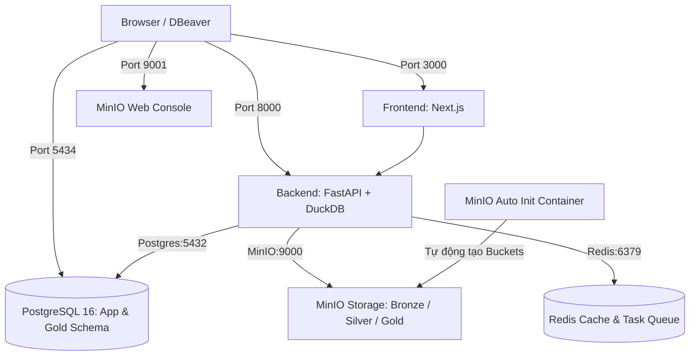

# 🐳 Hướng Dẫn Thiết Lập & Vận Hành Docker cho Thành Viên (UniDataLake AI)

Tài liệu này hướng dẫn chi tiết dành cho các thành viên team **UniDataLake AI** cách thiết lập môi trường Docker, khởi động toàn bộ hạ tầng dữ liệu (PostgreSQL, MinIO, Redis, DuckDB, Backend, Frontend), kết nối DBeaver và xử lý các tình huống thường gặp.

---

## 📋 Mục lục

1. [Tổng Quan Kiến Trúc Hạ Tầng Docker](#1-tổng-quan-kiến-trúc-hạ-tầng-docker)
2. [Các Bước Khởi Động Nhanh (Quick Start)](#2-các-bước-khởi-động-nhanh-quick-start)
3. [Bảng Tra Cứu Cổng (Port Mapping) & Đăng Nhập](#3-bảng-tra-cứu-cổng-port-mapping--đăng-nhập)
4. [Quy Trình Làm Việc Hàng Ngày Cho BE Developer](#4-quy-trình-làm-việc-hàng-ngày-cho-be-developer)
5. [Hướng Dẫn Kết Nối DBeaver VÀO PostgreSQL Docker](#5-hướng-dẫn-kết-nối-dbeaver-vào-postgresql-docker)
6. [Hướng Dẫn Truy Cập MinIO Web Console](#6-hướng-dẫn-truy-cập-minio-web-console)
7. [Giải Thích Về DuckDB Engine](#7-giải-thích-về-duckdb-engine)
8. [Các Lệnh Docker Thường Dùng & Troubleshooting](#8-các-lệnh-docker-thường-dùng--troubleshooting)

---

## 1. Tổng Quan Kiến Trúc Hạ Tầng Docker

Hệ thống hạ tầng của UniDataLake AI bao gồm 6 dịch vụ container được điều phối bởi `docker-compose.yml`:



---

## 2. Các Bước Khởi Động Nhanh (Quick Start)

### Bước 1: Tạo file cấu hình môi trường `.env`
Đứng tại thư mục gốc của dự án (`UniDataLake_AI/`) và chạy lệnh tạo file `.env` từ file mẫu:

```bash
cp .env.example .env
```

### Bước 2: Khởi động toàn bộ Hạ tầng bằng Docker Compose
```bash
docker compose up -d
```

### Bước 3: Kiểm tra trạng thái các dịch vụ
```bash
docker compose ps
```
*(Đảm bảo tất cả 5 dịch vụ chính `unilake-postgres`, `unilake-minio`, `unilake-redis`, `unilake-backend`, `unilake-frontend` đều ở trạng thái `Up / Healthy`).*

---

## 3. Bảng Tra Cứu Cổng (Port Mapping) & Đăng Nhập

| Dịch vụ | Container Name | Host Port | Internal Port | Đăng nhập mặc định / Đường dẫn truy cập |
| :--- | :--- | :--- | :--- | :--- |
| **PostgreSQL** | `unilake-postgres` | **5434** | 5432 | - Host: `localhost`, Port: `5434`<br>- DB: `unilake`, User: `unilake` (hoặc `root`) / Pass: `unilake`<br>- Source DB: `unilake_source`<br>- Reader User: `unilake_reader` / Pass: `unilake_reader` |
| **MinIO API** | `unilake-minio` | **9000** | 9000 | - Endpoint S3 API: `localhost:9000`<br>- Buckets tự động tạo: `bronze`, `silver`, `gold` |
| **MinIO Console**| `unilake-minio` | **9001** | 9001 | - Web UI: [http://localhost:9001](http://localhost:9001)<br>- Access Key: `minioadmin` / Secret Key: `minioadmin` |
| **Redis** | `unilake-redis` | **6379** | 6379 | - Host: `localhost:6379` |
| **Backend (FastAPI)** | `unilake-backend` | **8000** | 8000 | - Swagger UI API: [http://localhost:8000/docs](http://localhost:8000/docs)<br>- Healthcheck: [http://localhost:8000/health](http://localhost:8000/health) |
| **Frontend (Next.js)**| `unilake-frontend` | **3000** | 3000 | - Web App: [http://localhost:3000](http://localhost:3000) |

---

## 4. Quy Trình Làm Việc Hàng Ngày Cho BE Developer

Khi phát triển tính năng Backend, bạn **không cần chạy container backend trong Docker** để có thể chỉnh sửa code và xem log theo thời gian thực (Hot-reload).

### Quy trình đề xuất:

1. **Bật 3 dịch vụ hạ tầng trong Docker (Postgres, MinIO, Redis)**:
   ```bash
   docker compose up -d postgres minio redis
   ```

2. **Kích hoạt Virtual Environment Python ở máy local**:
   ```bash
   source .venv/bin/activate
   ```

3. **Chạy Backend FastAPI local ở chế độ `--reload`**:
   ```bash
   uvicorn app.main:app --app-dir backend --reload --port 8000
   ```

*(Khi Backend chạy local ngoài Docker, nó sẽ tự động truy cập vào PostgreSQL trong Docker thông qua port `5434` được khai báo trong file `.env`).*

---

## 5. Hướng Dẫn Kết Nối DBeaver VÀO PostgreSQL Docker

Do máy cá nhân của thành viên có thể đã cài sẵn PostgreSQL local chiếm port `5432` hoặc `5433`, PostgreSQL trong Docker đã được map sang port **`5434`**.

### Các bước cấu hình trên DBeaver:

1. Mở **DBeaver** -> Nhấn nút **New Database Connection** -> Chọn **PostgreSQL**.
2. Điền thông tin kết nối:
   - **Host**: `localhost` (hoặc `127.0.0.1`)
   - **Port**: `5434`
   - **Database**: `unilake` (hoặc `unilake_source` để xem DB nguồn giả lập)
   - **Username**: `unilake` (hoặc `root`)
   - **Password**: `unilake` (hoặc `2805`)
3. Nhấn nút **Test Connection** -> Nhấn **Finish** để lưu.

---

## 6. Hướng Dẫn Truy Cập MinIO Web Console

MinIO đóng vai trò lưu trữ Data Lake (Raw / Bronze / Silver / Gold Object Storage):

1. Truy cập trình duyệt: [http://localhost:9001](http://localhost:9001)
2. Đăng nhập với thông tin:
   - **Username**: `minioadmin`
   - **Password**: `minioadmin`
3. Tại giao diện MinIO, bạn sẽ thấy 3 buckets đã được khởi tạo tự động bởi container `minio-init`:
   - `bronze`: Nơi chứa dữ liệu thô (Raw Data), đã được bật Versioning.
   - `silver`: Nơi chứa dữ liệu đã làm sạch (Cleaned Data / Parquet).
   - `gold`: Nơi chứa dữ liệu tổng hợp (Aggregated Analytics).

---

## 7. Giải Thích Về DuckDB Engine

❓ **Thành viên có cần cài đặt container DuckDB riêng trong Docker không?**
- 👉 **KHÔNG CẦN.** DuckDB là một **Embedded Database Engine (Cơ sở dữ liệu nhúng)** tương tự SQLite.
- DuckDB hoạt động trực tiếp dưới dạng một thư viện Python (`duckdb>=1.1.0`) nhúng thẳng bên trong Backend.
- Khi Backend chạy (local hoặc Docker), nó tự nạp DuckDB vào bộ nhớ RAM (`DUCKDB_PATH=:memory:`) để thực hiện các truy vấn đĩa/Parquet với tốc độ cao.

---

## 8. Các Lệnh Docker Thường Dùng & Troubleshooting

### Bảng Tra Cứu Lệnh

| Thao tác | Lệnh thực thi |
| :--- | :--- |
| Kiểm tra trạng thái các container | `docker compose ps` |
| Xem log thời gian thực của tất cả service | `docker compose logs -f` |
| Xem log riêng của Backend | `docker compose logs -f backend` |
| Xem log riêng của Postgres | `docker compose logs -f postgres` |
| Khởi động lại dịch vụ Backend | `docker compose restart backend` |
| Tắt toàn bộ hệ thống container | `docker compose down` |
| Rebuild lại container khi cập nhật Dockerfile | `docker compose up -d --build` |

### Troubleshooting Thường Gặp

#### 1. Lỗi `bind: address already in use` trên port 5432 hoặc 5433
- **Nguyên nhân**: Máy cá nhân đang bật sẵn PostgreSQL local.
- **Khắc phục**: File `docker-compose.yml` dự án đã map port Docker Postgres sang **`5434`**. Sử dụng port `5434` trên DBeaver và file `.env`.

#### 2. Lỗi `pull access denied for minio/minio` hoặc `minio/mc`
- **Nguyên nhân**: Docker Hub hạn chế tài khoản ẩn danh đối với các repo chính thức của MinIO.
- **Khắc phục**: File `docker-compose.yml` của dự án đã chuyển sang sử dụng image công khai `elestio/minio:latest` và `pgsty/mc:RELEASE.2026-09-16T00-00-00Z`.

#### 3. Lỗi gián đoạn mạng khi build Backend Image
- **Khắc phục**: Chạy lại lệnh build với flag `--no-cache`:
  ```bash
  docker compose build --no-cache backend
  docker compose up -d
  ```
