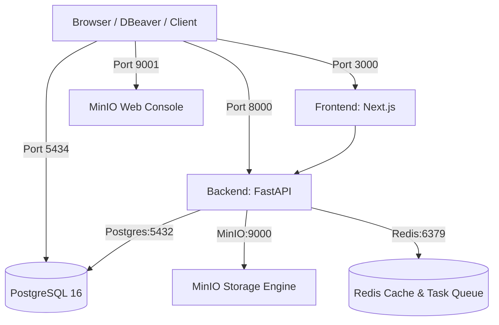

# 🐳 Hướng Dẫn Vận Hành & Khởi Động Docker (UniDataLake AI)

Tài liệu này hướng dẫn chi tiết cách thiết lập, vận hành hạ tầng Docker, kết nối Database qua DBeaver và quản lý các dịch vụ (PostgreSQL, MinIO, Redis, Backend, Frontend) trong dự án **UniDataLake AI**.

---

## 📋 Mục lục

1. [Tổng quan về các dịch vụ Docker](#1-tổng-quan-về-các-dịch-vụ-docker)
2. [Yêu cầu chuẩn bị (Prerequisites)](#2-yêu-cầu-chuẩn-bị-prerequisites)
3. [Cấu hình Cổng (Port Mapping) & Bảng Truy Cập](#3-cấu-hình-cổng-port-mapping--bảng-truy-cập)
4. [Hướng dẫn Khởi chạy với Docker Compose](#4-hướng-dẫn-khởi-chạy-với-docker-compose)
5. [Hướng dẫn Kết nối DBeaver vào PostgreSQL Docker](#5-hướng-dẫn-kết-nối-dbeaver-vào-postgresql-docker)
6. [Hướng dẫn Truy cập MinIO Web Console](#6-hướng-dẫn-truy-cập-minio-web-console)
7. [Bảng Tra Cứu Lệnh Docker Thường Dùng](#7-bảng-tra-cứu-lệnh-docker-thường-dùng)
8. [Xử Lý Lỗi Thường Gặp (Troubleshooting)](#8-xử-lý-lỗi-thường-gặp-troubleshooting)

---

## 1. Tổng quan về các dịch vụ Docker

Hạ tầng Docker của UniDataLake AI bao gồm 5 container chính được điều phối qua `docker-compose.yml`:



---

## 2. Yêu cầu chuẩn bị (Prerequisites)

- **Docker Desktop**: Đã cài đặt và khởi động (`docker --version`).
- **File biến môi trường**: Đã tạo file `.env` từ `.env.example`:
  ```bash
  cp .env.example .env
  ```

---

## 3. Cấu hình Cổng (Port Mapping) & Bảng Truy Cập

| Service | Container Name | Host Port | Internal Port | Địa chỉ truy cập / Mô tả |
| :--- | :--- | :--- | :--- | :--- |
| **Backend** | `unilake-backend` | **8000** | 8000 | - Swagger API: [http://localhost:8000/docs](http://localhost:8000/docs)<br>- Healthcheck: [http://localhost:8000/health](http://localhost:8000/health) |
| **Frontend** | `unilake-frontend` | **3000** | 3000 | - Web App: [http://localhost:3000](http://localhost:3000) |
| **PostgreSQL** | `unilake-postgres` | **5434** | 5432 | - Database connection: `localhost:5434` *(Tránh xung đột cổng 5432 của Postgres local)* |
| **MinIO API** | `unilake-minio` | **9000** | 9000 | - S3 API Endpoint: `localhost:9000` |
| **MinIO Console**| `unilake-minio` | **9001** | 9001 | - Admin Console UI: [http://localhost:9001](http://localhost:9001) |
| **Redis** | `unilake-redis` | **6379** | 6379 | - Redis Cache: `localhost:6379` |

---

## 4. Hướng dẫn Khởi chạy với Docker Compose

Đứng tại thư mục gốc của dự án (`UniDataLake_AI/`), thực thi các lệnh sau:

### 4.1. Khởi chạy toàn bộ hệ thống (Hạ tầng + Backend + Frontend)
```bash
docker compose up -d
```

### 4.2. Khởi chạy riêng các dịch vụ Hạ tầng (Database/MinIO/Redis)
Nếu bạn muốn tự chạy Backend và Frontend local để debug code:
```bash
docker compose up -d postgres minio redis
```

### 4.3. Build lại container khi thay đổi mã nguồn
```bash
docker compose up -d --build
```

---

## 5. Hướng dẫn Kết nối DBeaver vào PostgreSQL Docker

Do máy cá nhân có thể đang chạy dịch vụ PostgreSQL cục bộ chiếm port `5432`, container PostgreSQL trong Docker đã được map sang port **`5434`**.

### Các bước thực hiện trên DBeaver:

1. Mở **DBeaver** -> Nhấn nút **New Database Connection** (biểu tượng phích cắm) -> Chọn **PostgreSQL**.
2. Điền thông tin kết nối như sau:
   - **Host**: `localhost` (hoặc `127.0.0.1`)
   - **Port**: `5434`
   - **Database**: `unidatalake` (hoặc cấu hình trong `.env`)
   - **Username**: `root` (hoặc cấu hình trong `.env`)
   - **Password**: `2805` (hoặc cấu hình trong `.env`)
3. Nhấn nút **Test Connection** để kiểm tra -> Nhấn **Finish** để lưu.

---

## 6. Hướng dẫn Truy cập MinIO Web Console

MinIO đóng vai trò lưu trữ Data Lake (Object Storage):

1. Truy cập trình duyệt: [http://localhost:9001](http://localhost:9001)
2. Điền thông tin đăng nhập mặc định:
   - **Username (Access Key)**: `minioadmin`
   - **Password (Secret Key)**: `minioadmin`
3. Bạn có thể xem/tạo các Buckets dữ liệu (`bronze`, `silver`, `gold`, v.v.) trực tiếp trên giao diện này.

---

## 7. Bảng Tra Cứu Lệnh Docker Thường Dùng

| Thao tác | Lệnh thực thi |
| :--- | :--- |
| Kiểm tra danh sách container | `docker compose ps` |
| Xem log realtime tất cả container | `docker compose logs -f` |
| Xem log của dịch vụ Backend | `docker compose logs -f backend` |
| Xem log của dịch vụ Postgres | `docker compose logs -f postgres` |
| Khởi động lại dịch vụ Backend | `docker compose restart backend` |
| Tắt toàn bộ hạ tầng | `docker compose down` |
| Tắt và xóa sạch volumes dữ liệu | `docker compose down -v` |

---

## 8. Xử Lý Lỗi Thường Gặp (Troubleshooting)

### 8.1. Lỗi `pull access denied for minio/minio`
- **Nguyên nhân**: Docker Hub hạn chế tài khoản ẩn danh tải image `minio/minio`.
- **Giải pháp**: File `docker-compose.yml` của dự án đã chuyển sang dùng `image: elestio/minio:latest` hoàn toàn miễn phí và không bị giới hạn.

### 8.2. Lỗi `bind: address already in use` trên port 5432/5433
- **Nguyên nhân**: Máy cá nhân đang chạy sẵn PostgreSQL cài trực tiếp trên hệ điều hành.
- **Giải pháp**: Dự án đã chuyển port của PostgreSQL container sang `5434`. Khi kết nối qua DBeaver hoặc code local, hãy dùng port `5434`.

### 8.3. Lỗi timeout / rpc error khi `pip install` trong Docker Build
- **Nguyên nhân**: Quá trình tải các thư viện nặng (`ortools`, `duckdb`, `pandas`) gặp gián đoạn mạng.
- **Giải pháp**: Chạy lại lệnh build với flag `--no-cache-dir`:
  ```bash
  docker compose build --no-cache backend
  docker compose up -d
  ```
